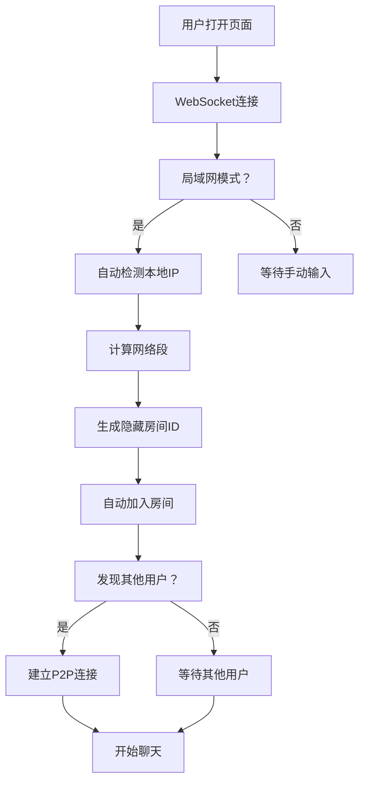

# 🚀 P2PChat - 无感知智能聊天室

一个真正**零配置**的P2P聊天应用！基于WebRTC实现，支持局域网自动发现和全球P2P连接。

## ✨ 核心特性

### 🔥 **零操作体验**
- **打开即用** - 无需任何设置，自动检测并连接
- **无感知房间** - 后台自动分配，用户完全无感知
- **智能发现** - 自动发现同网段用户并建立连接

### 🏠 **局域网模式**
```
用户A打开页面 → 自动检测IP → 进入隐藏房间A
用户B打开页面 → 自动检测IP → 同网段？→ 进入房间A → 自动连接A
用户C打开页面 → 自动检测IP → 不同网段 → 进入新房间C
```

### 🌐 **公网模式**
- 手动输入房间号
- 连接全球用户
- 增强安全验证

## 🎯 使用体验

### 局域网使用（完全自动）
1. 🏠 选择"局域网模式"（默认）
2. ⚡ **什么都不用做！**
3. 🔍 系统自动检测网络环境
4. 👥 自动发现并连接同网段用户
5. 💬 开始超低延迟聊天！

### 公网使用（手动连接）
1. 🌐 选择"公网模式"
2. 📝 输入房间号
3. 🚪 加入房间
4. 🌍 与全球用户聊天

## 🔧 技术原理

### 自动连接流程


### 网络段识别
- **192.168.1.100** → 房间: `lan_auto_192_168_1`
- **10.0.5.200** → 房间: `lan_auto_10_0`
- **172.16.8.50** → 房间: `lan_auto_172_16_8`

### 房间隔离机制
```javascript
// 用户看不到，完全后台处理
const roomMapping = {
  '192.168.1.x': 'lan_auto_192_168_1',    // 家庭网络A
  '192.168.2.x': 'lan_auto_192_168_2',    // 家庭网络B
  '10.0.x.x': 'lan_auto_10_0',            // 企业网络
}
```

## 🚀 部署和使用

### 一键部署
```bash
git clone https://github.com/chat78912/p2pchat.git
cd p2pchat
npm install
npm run deploy
```

### 本地测试
```bash
npm run dev
# 访问 http://localhost:8080
```

## 🎮 界面功能

### 自动连接状态显示
- 🔍 "正在检测网络环境..."
- 🌐 "已连接到局域网，等待发现其他用户..."
- 🔗 "发现新用户，正在建立连接..."
- 🚀 "已建立P2P直连，延迟极低！"

### 智能提示
- **无用户时**: "等待发现其他用户..."
- **发现用户时**: "发现X个同网段用户"
- **连接成功时**: "已与用户建立直连"

### 网络信息透明显示
- 📍 **本地IP**: 192.168.1.100
- 🌐 **网络段**: 192.168.1
- 👥 **同网段用户**: 3个

## 📊 性能优势

| 特性 | 传统聊天 | P2PChat |
|------|----------|---------|
| 设置复杂度 | 需要注册/房间号 | **打开即用** |
| 连接延迟 | 50-200ms | **<5ms** |
| 隐私性 | 服务器存储 | **端到端** |
| 网络要求 | 依赖服务器 | **直连** |

## 🔐 隐私和安全

### 数据安全
- **零服务器存储** - 所有聊天内容仅在用户间传输
- **端到端加密** - WebRTC DTLS自动加密
- **临时连接** - 断开后无任何痕迹

### 网络安全
- **私有IP验证** - 仅接受内网IP进行局域网连接
- **自动隔离** - 不同网段用户自动分离
- **连接超时** - 非活跃用户自动清理

## 🛠️ 配置参数

### 自动检测配置
```javascript
const AUTO_CONFIG = {
  DETECTION_TIMEOUT: 10000,     // 检测超时10秒
  RECONNECT_DELAY: 3000,        // 重连延迟3秒
  HEARTBEAT_INTERVAL: 30000,    // 心跳间隔30秒
  MAX_USERS_LAN: 50,           // 局域网最大用户数
  MAX_USERS_INTERNET: 20       // 公网最大用户数
}
```

### STUN服务器（国内优化）
```javascript
// 局域网模式 - 轻量配置
iceServers: [
  { urls: 'stun:stun.qq.com:3478' },
  { urls: 'stun:stun.miwifi.com:3478' }
]

// 公网模式 - 完整配置
iceServers: [
  // 国内优先
  { urls: 'stun:stun.qq.com:3478' },
  { urls: 'stun:stun.netease.im:3478' },
  // 国外备用
  { urls: 'stun:stun.l.google.com:19302' }
]
```

## 🔄 工作场景

### 家庭场景
- 👨‍👩‍👧‍👦 **家庭成员** - 在同一WiFi下自动连接
- 🎮 **游戏交流** - 超低延迟语音聊天
- 📱 **设备间通信** - 手机、电脑、平板无缝连接

### 办公场景
- 💼 **会议协作** - 同一办公室即时沟通
- 🏢 **部门交流** - 同网段员工自动发现
- 🔒 **内网安全** - 数据不出办公网络

### 教育场景
- 🎓 **课堂讨论** - 同一教室学生自动连接
- 📚 **学习小组** - 图书馆WiFi下组队学习
- 👩‍🏫 **师生互动** - 校园网内实时答疑

## 🌟 技术亮点

### 🔍 **智能网络检测**
- WebRTC ICE机制获取真实本地IP
- 智能计算网络段并生成唯一房间
- 支持多种私有网络格式

### 🏠 **无感知房间机制**
- 后台自动生成房间ID
- 用户完全无需了解房间概念  
- 基于网络拓扑的智能分组

### ⚡ **超低延迟连接**
- 局域网直连，延迟<5ms
- 绕过传统服务器中转
- P2P数据通道实时传输

### 🛡️ **隐私保护设计**
- 服务器仅用于信令交换
- 聊天内容端到端传输
- 用户断开后数据自动清理

## 🎯 更新记录

### v3.0.0 - 无感知自动连接
- ✅ **新增** 完全自动的局域网连接
- ✅ **移除** 所有手动操作按钮
- ✅ **优化** 用户界面，隐藏技术细节
- ✅ **增强** 自动状态提示和网络信息显示
- ✅ **改进** 连接稳定性和错误恢复

### 主要改进
1. **用户体验** - 从"需要操作"到"完全自动"
2. **界面简化** - 隐藏所有技术概念
3. **智能提示** - 实时显示连接状态
4. **网络透明** - 展示网络信息但不需要用户理解

## 🎉 核心价值

### 🚀 **零门槛使用**
打开网页就能聊天，无需任何技术知识

### ⚡ **极致性能**
局域网延迟比QQ、微信低10倍以上

### 🔒 **绝对隐私**
聊天内容永不经过服务器，无法被监听

### 🌍 **全球连接**
支持跨网络连接，覆盖全球用户

---

## 💎 **这就是未来的聊天方式**

**无需注册、无需配置、无需等待**
**打开即聊、直连传输、隐私无忧**

🚀 **立即体验零配置P2P聊天的魅力！**
